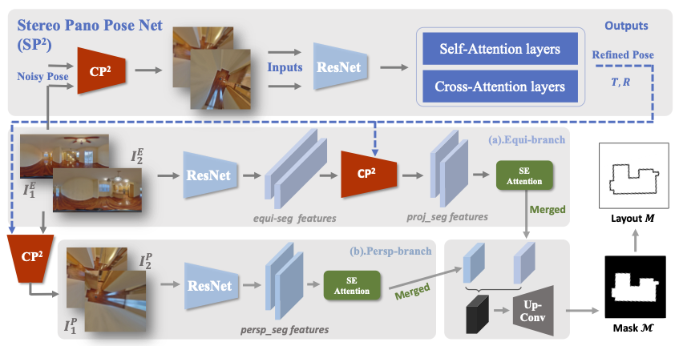

# PSMNet: Position-aware Stereo Merging Network for Room Layout Estimation
Created by Haiyan Wang, Will Hutchcroft, Yuguang Li, Zhiqiang Wan, Ivaylo Boyadzhiev, Yingli Tian, Sing Bing Kang from <a href="https://www.zillow.com/" target="_blank">Zillow</a> and <a href="https://www.ccny.cuny.edu/" target="_blank">The City College of New York</a>.
<p align="center">
    
</p>

## Introduction

This repository contains the pytorch demo code for our <a href="https://openaccess.thecvf.com/content/CVPR2022/papers/Wang_PSMNet_Position-Aware_Stereo_Merging_Network_for_Room_Layout_Estimation_CVPR_2022_paper.pdf" target="_blank">PSMNet</a> paper, which aims at estimating layout from multi-view panoramas. Our paper has been accepted at CVPR 2022. Our system, called Position-aware Stereo Merging Network or PSMNet, is an end-to-end joint layout-pose estimator. PSMNet consists of a Stereo Pano Pose (SP2) transformer and a novel Cross-Perspective Projection (CP2) layer. The stereo-view SP2 transformer is used to implicitly infer correspondences between views, and can handle noisy poses. The pose-aware CP2 layer is designed to render features from the adjacent view to the anchor (reference) view, in order to perform view fusion and estimate the visible layout. Our experiments and analysis validate our method, which significantly outperforms the state-of-the-art layout estimators, especially for large and complex room spaces.

## Installation

We recommend conda for installation:

```
conda create -n psmnet python=3.7
conda activate psmnet
Linux: pip install torch==1.8.1+cpu torchvision==0.9.1+cpu torchaudio==0.8.1 -f https://download.pytorch.org/whl/torch_stable.html / Mac: pip install torch==1.9.0 torchvision==0.10.0 torchaudio==0.9.0)
pip install -r requirements.txt
```

## Pretrained Model

First, please download the [pretrained model](https://drive.google.com/file/d/1IuOXkLj3Rb9ywzu3g3NP_IRPi71NJ_RO/view?usp=sharing) by running the following commands: 

```
mkdir checkpoints
cd checkpoints
gdown 1IuOXkLj3Rb9ywzu3g3NP_IRPi71NJ_RO
cd ..
```

## Predict

Place two ZInD panoramas and the corresponding PSMNet GT data file in the assets folder (or use the existing provided files). For our demo, the PSMNet GT data file provides the GT pose, in order to simulate a noisy input pose for refinement, as well as the vanishing angle parameter for manhattan-aligned post-processing. Then, run the following command to load the pretrained model and predict the 3D layout:

```
python demo.py 
```
<p align="center">
    
</p>


## Dataset
The pair-wise PSMNet data was derived from ZInD, and partitioned according to the ZInD public train/test/val split. The zipped data for each partition may be downloaded here: [train](https://files.zillowstatic.com/research/public/StaticFiles/psmnet/train.zip), [test](https://files.zillowstatic.com/research/public/StaticFiles/psmnet/test.zip), [valid](https://files.zillowstatic.com/research/public/StaticFiles/psmnet/valid.zip). Each data file is named by the concatenation of the corresponding ZInD identifiers for each panorama in the pair, and contains the relative pose, the joint visible layout, the vanishing angles for each panorama, and the ceiling height, as well as the metrics used for analysis in the paper: covisibility score and spatial overlap. 


## Citation

If you find our work useful for your research, please consider citing:

```
@InProceedings{Wang_2022_CVPR,
    author    = {Wang, Haiyan and Hutchcroft, Will and Li, Yuguang and Wan, Zhiqiang and Boyadzhiev, Ivaylo and Tian, Yingli and Kang, Sing Bing},
    title     = {PSMNet: Position-Aware Stereo Merging Network for Room Layout Estimation},
    booktitle = {Proceedings of the IEEE/CVF Conference on Computer Vision and Pattern Recognition (CVPR)},
    month     = {June},
    year      = {2022},
    pages     = {8616-8625}
}
```

## Related Projects

[DuLa-Net](https://github.com/SunDaDenny/DuLa-Net)

[LoFTR](https://github.com/zju3dv/LoFTR)

## License
This work is released under Creative Commons Attribution-NonCommercial-NoDerivatives 4.0 International Public License (see LICENSE file for more details).